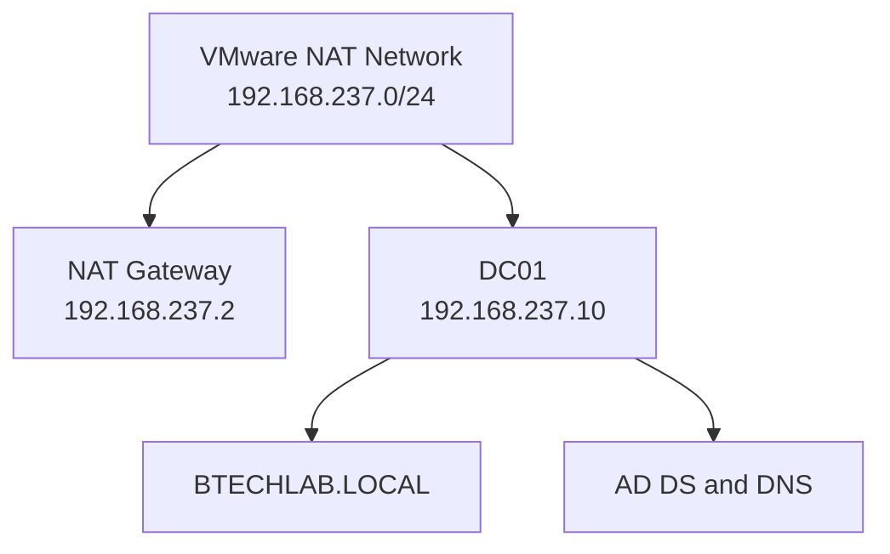
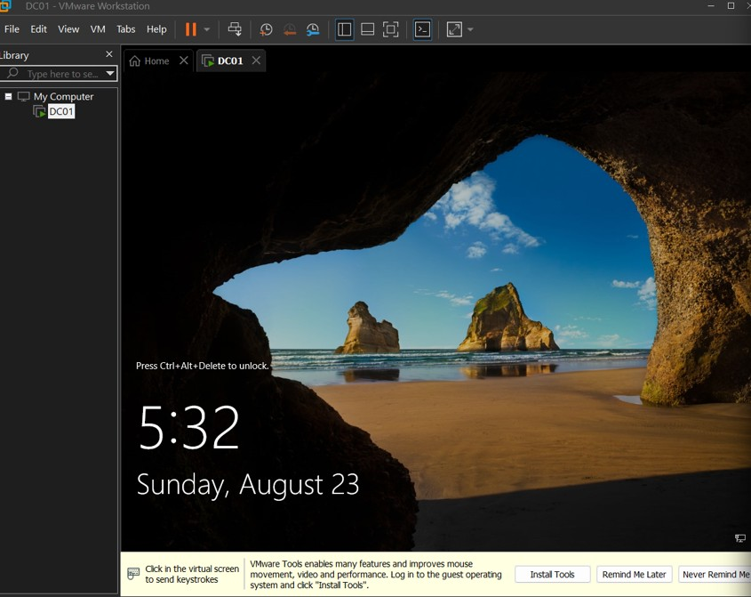
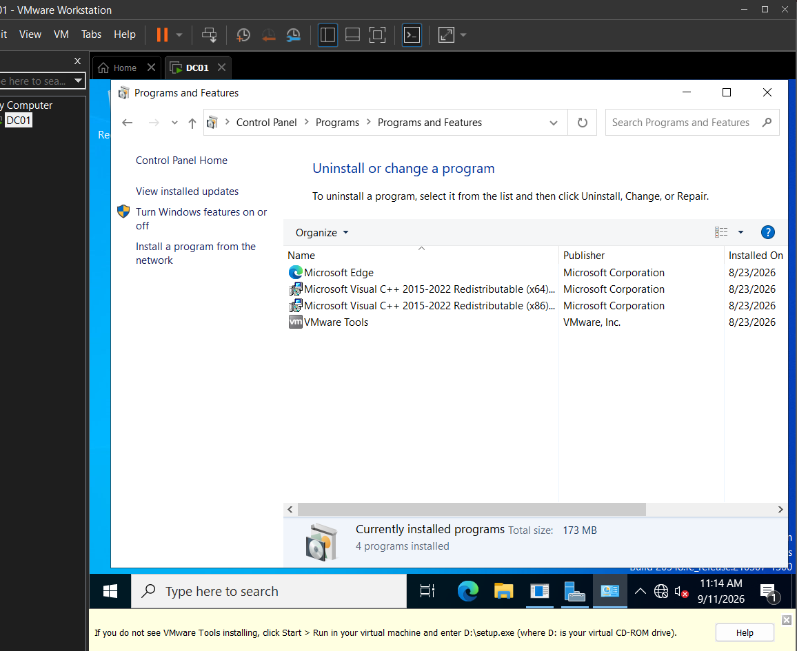
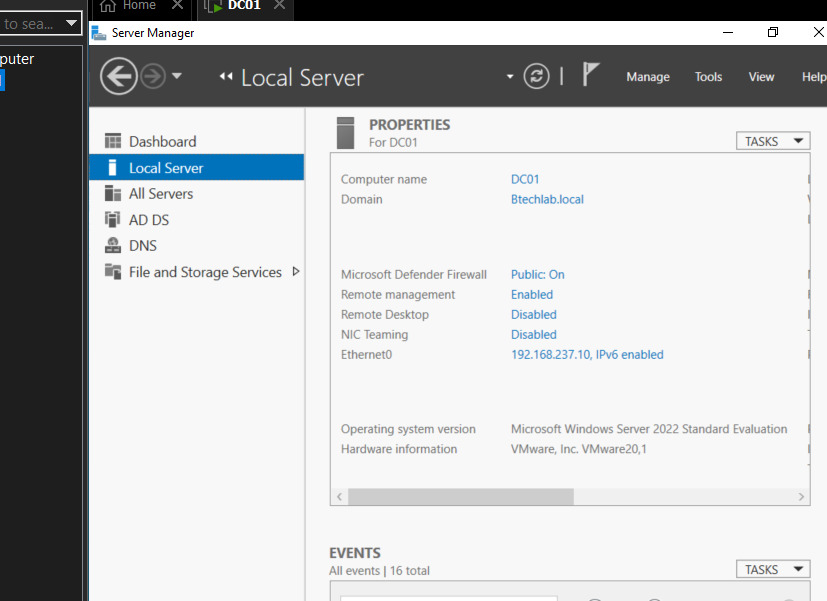
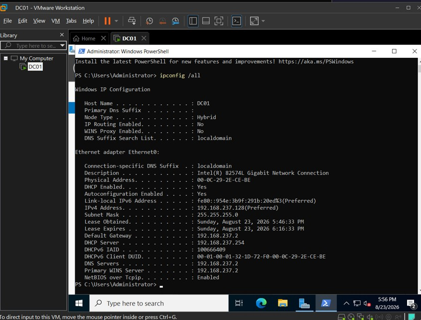
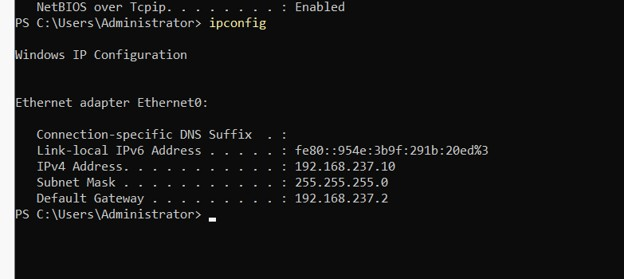
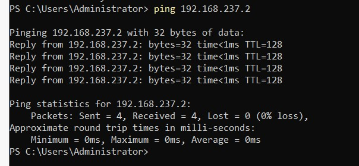
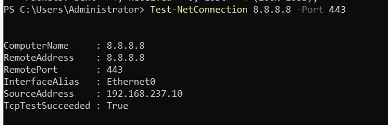

# Enterprise IT Home Lab

## Overview

This project documents my progress building an enterprise-style Windows domain environment using VMware Workstation and Windows Server 2022. The lab allows me to practice server administration, networking, Active Directory, DNS, user management, and common help desk tasks.

## Technologies Used

- VMware Workstation
- Windows Server 2022
- Active Directory Domain Services (AD DS)
- Domain Name System (DNS)
- PowerShell
- TCP/IP networking

## Current Lab Environment



## Phase 1: Windows Server Setup

I created a virtual machine in VMware Workstation and installed Windows Server 2022. I also installed VMware Tools to improve the virtual machine's performance and its integration with the host computer.




## Phase 2: Server Identity and Network Configuration

### Renaming the Server

I renamed the Windows Server computer to `DC01`. The name identifies the server as the first domain controller in the lab and follows a simple organizational naming convention.



### Reviewing the Original Configuration

Before making network changes, I reviewed the server's current configuration with `ipconfig`. VMware's DHCP service originally assigned the server's address automatically.



### Assigning a Static IPv4 Address

A domain controller needs a predictable address so clients can consistently locate domain and DNS services. I assigned DC01 the following configuration:

| Setting | Value |
|---|---|
| IP address | `192.168.237.10` |
| Subnet mask | `255.255.255.0` |
| Default gateway | `192.168.237.2` |
| Preferred DNS server | `192.168.237.10` |

DC01 points to itself for DNS because it also hosts the DNS service for the Active Directory domain.

### Connectivity Testing and Troubleshooting

I verified the new configuration with `ipconfig` and tested connectivity to the VMware NAT gateway. I also used `Test-NetConnection` to test outbound connectivity over TCP port 443.

The initial external name-resolution test failed because DC01 was pointing to itself before the DNS role had been installed. TCP connectivity confirmed that the server could reach the internet, allowing me to separate the DNS problem from the underlying network connection.







## Phase 3: Active Directory Domain Services and DNS

### Installing AD DS

Using Server Manager, I installed the Active Directory Domain Services role and promoted DC01 to a domain controller. I created a new forest named `BTECHLAB.LOCAL` and kept the DNS Server and Global Catalog options enabled.

I also created a Directory Services Restore Mode password. DSRM provides a recovery environment that administrators can use if Active Directory becomes damaged or requires offline maintenance.

The DNS delegation warning was expected because this is a new internal lab domain without an existing parent DNS infrastructure.


### Verifying Active Directory

After the server restarted, I opened Active Directory Users and Computers and verified that DC01 appeared in the Domain Controllers organizational unit.


### Verifying DNS

In DNS Manager, I confirmed that the following forward lookup zones were created:

- `btechlab.local`
- `_msdcs.btechlab.local`

Active Directory depends on DNS so domain clients can locate services provided by the domain controller.


I used `nslookup` to test resolution for the domain, the domain controller, and an external domain:

```powershell
nslookup btechlab.local
nslookup dc01.btechlab.local
nslookup microsoft.com
```

The tests confirmed that internal Active Directory records and external domain names could be resolved.


## Phase 4: Building the Organization

### Creating Organizational Units

I created separate organizational units for four fictional departments:

- IT
- Human Resources
- Finance
- Marketing

Each department contains `Users` and `Computers` sub-OUs. This structure organizes directory objects and will allow department-specific Group Policies to be applied later.

```text
BTECHLAB.LOCAL
├── IT
│   ├── Users
│   └── Computers
├── Human Resources
│   ├── Users
│   └── Computers
├── Finance
│   ├── Users
│   └── Computers
└── Marketing
    ├── Users
    └── Computers
```


### Employee Onboarding and Account Support

I created fictional employee accounts and placed them in the appropriate department OUs. I then practiced common account-management tasks that are regularly performed by help desk and system administration teams:

- Creating user accounts
- Disabling and enabling accounts
- Resetting passwords
- Unlocking accounts
- Adding users to groups
- Removing users from groups


## Skills Demonstrated

- Windows Server installation and configuration
- Static IPv4 addressing
- Network connectivity testing
- Network and DNS troubleshooting
- Active Directory Domain Services installation
- Domain controller promotion
- Internal and external DNS verification
- Organizational unit design
- User and group administration
- Account lifecycle and help desk support
- Technical documentation

## Current Status and Next Steps

This project is still in progress. Planned additions include:

- Create and configure a Windows client virtual machine
- Join the client to `BTECHLAB.LOCAL`
- Configure security groups and shared-folder permissions
- Create and test Group Policy Objects
- Use PowerShell to automate user creation and other administrative tasks
- Document additional troubleshooting scenarios

## Security Note

All employee names and accounts shown in this project are fictional and were created only for this lab. Passwords, recovery credentials, and other sensitive information are not included.
